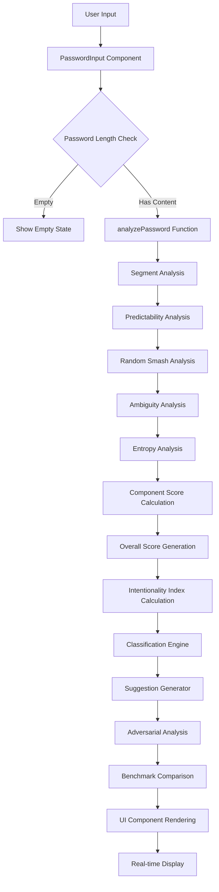
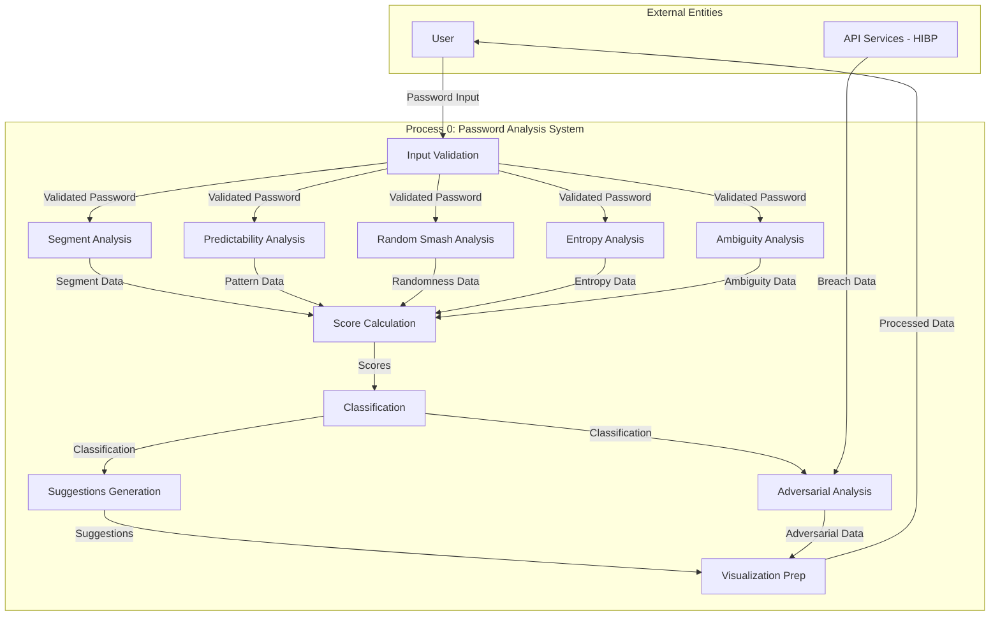
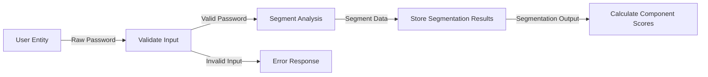
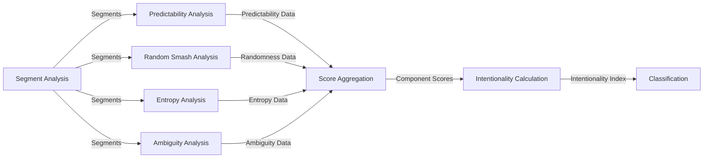
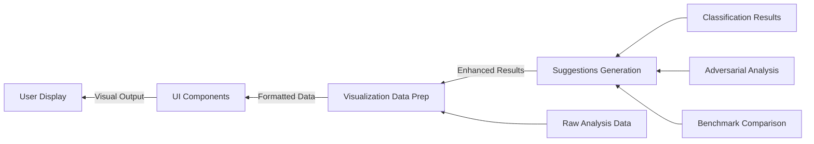
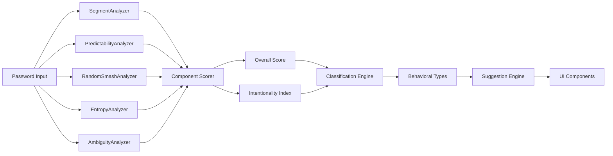
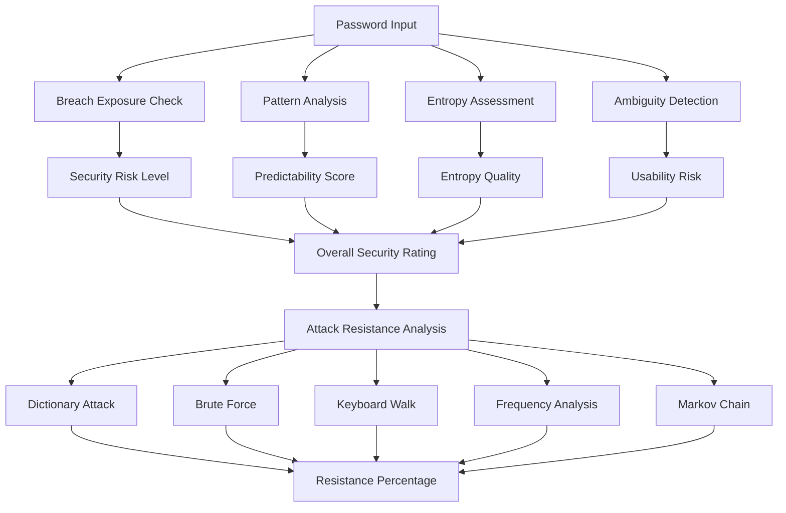

# IntentPass - Advanced Password Intentionality Analyzer

[](https://nextjs.org)
[](https://www.typescriptlang.org)
[](https://reactjs.org)
[](https://tailwindcss.com)

A cutting-edge password analysis platform that evaluates passwords beyond traditional complexity rules by measuring **intentionality**, **structural coherence**, and **actual security strength**.


##  Key Features

###  Multi-Dimensional Password Analysis
- **Intentionality Index**: Measures whether a password shows deliberate design vs random generation
- **Structural Coherence**: Evaluates logical segmentation and organization
- **Entropy Quality**: Advanced entropy calculation with character distribution analysis
- **Pattern Detection**: Identifies predictable sequences, keyboard walks, and weak substrings
- **Ambiguity Analysis**: Detects confusable characters that may cause entry errors

###  Behavioral Classification
Automatically categorizes passwords into five behavioral types:
- **Predictable**: Contains detectable sequences/patterns
- **Random**: High entropy, appears randomly generated
- **Passphrase**: Word-based passwords separated by spaces
- **Compliance Hack**: Meets rules but lacks intentionality
- **Balanced**: Well-designed with intention and security

###  Real-Time Security Intelligence
- **Breach Exposure Check**: Integrates with Have I Been Pwned API (client-side, privacy-safe)
- **Adversarial Simulation**: Analyzes resistance to 5 attack types (dictionary, brute force, keyboard walk, frequency analysis, Markov chain)
- **Policy Mode**: Toggle between Consumer (8 chars) and Enterprise (14 chars, NIST/CIS compliant) requirements

### Advanced Visualizations
- **6-Axis Radar Chart**: Multi-dimensional intentionality visualization
- **Entropy Distribution Map**: Segment-by-segment entropy breakdown
- **Keyboard Heatmap**: Interactive QWERTY usage visualization
- **Evolution Tracker**: Compare password versions over time
- **Benchmark Comparison**: Compare IntentPass vs Rule-Based vs zxcvbn-like systems

###  Gamification & Feedback
- **Tier System**: Bronze/Silver/Gold/Platinum badges based on intentionality score
- **AI-Powered Suggestions**: Context-specific improvement recommendations
- **Real-time Diagnostics**: Strengths and warnings as you type


##  Architecture Overview

```
app/
├── page.tsx              # Main application page
├── layout.tsx            # Root layout with metadata
└── globals.css           # Global styles and theme

components/
├── ui/                   # Reusable UI components (shadcn/ui)
├── PasswordInput.tsx     # Secure password entry component
├── ScoreDisplay.tsx      # Visual score presentation
├── RadarChart.tsx        # Multi-dimensional visualization
├── KeyboardHeatmap.tsx   # Interactive keyboard usage
├── EntropyMap.tsx        # Entropy distribution visualization
├── BreachStatus.tsx      # HIBP integration component
├── TierBadge.tsx         # Gamified tier display
├── BehavioralClassification.tsx  # Password type classifier
├── SuggestionsPanel.tsx  # AI improvement recommendations
├── AdversarialAnalysis.tsx       # Attack resistance analysis
├── BenchmarkComparison.tsx       # System comparison matrix
├── PolicyToggle.tsx      # Consumer/Enterprise mode switch
└── theme-provider.tsx    # Dark/light theme support

lib/
├── analyzer/             # Core analysis engine
│   ├── scorer.ts         # Main analysis orchestrator
│   ├── segmentAnalyzer.ts     # Password segmentation
│   ├── predictabilityAnalyzer.ts  # Pattern detection
│   ├── randomSmashAnalyzer.ts     # Randomness detection
│   ├── entropyAnalyzer.ts         # Entropy calculation
│   ├── ambiguityAnalyzer.ts       # Confusable character detection
│   ├── breachChecker.ts           # HIBP integration
│   ├── classifier.ts              # Behavioral classification
│   ├── suggestions.ts             # AI recommendations
│   ├── adversarial.ts             # Attack simulation
│   ├── benchmark.ts               # System comparison
│   ├── types.ts                   # TypeScript interfaces
│   └── constants.ts               # Configuration constants
│
└── context/
    └── PolicyContext.tsx          # Policy mode management

hooks/
├── use-mobile.ts         # Mobile detection hook
└── use-toast.ts          # Toast notification hook
```

# IntentPass System Flow & Architecture

##  System Data Flow Architecture

### 1. Main Application Flow



### 2. Password Analysis DFD (Data Flow Diagram - Level 0)



### 2.1. Password Analysis DFD (Level 1 - Input Processing)



### 2.2. Password Analysis DFD (Level 1 - Core Analysis)



### 2.3. Password Analysis DFD (Level 1 - Output Processing)



### 3. Component Analysis Pipeline


## Getting Started

### Prerequisites
- Node.js 18+ or pnpm
- Modern web browser

### Installation

```bash
# Clone the repository
git clone <repository-url>
cd intent-pass-password-engine

# Install dependencies
npm install

# Start development server
npm dev
```

The application will be available at `http://localhost:3000`

### Build for Production

```bash
# Build the application
npm build

# Start production server
npm start
```
Security Analysis Pipeline



