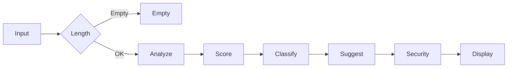
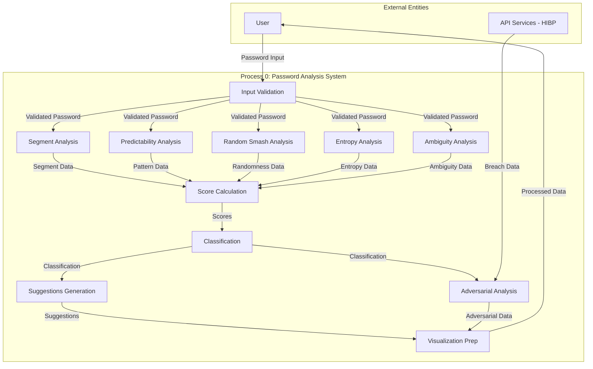
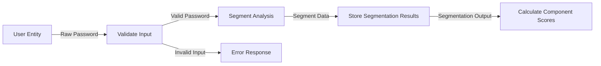
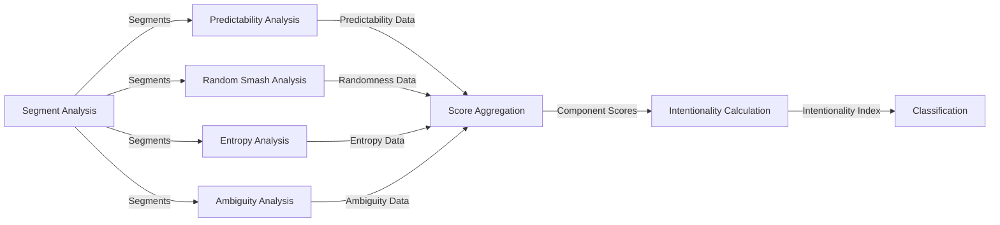
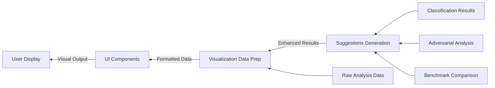
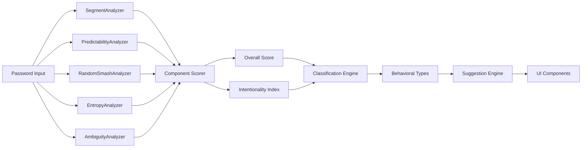
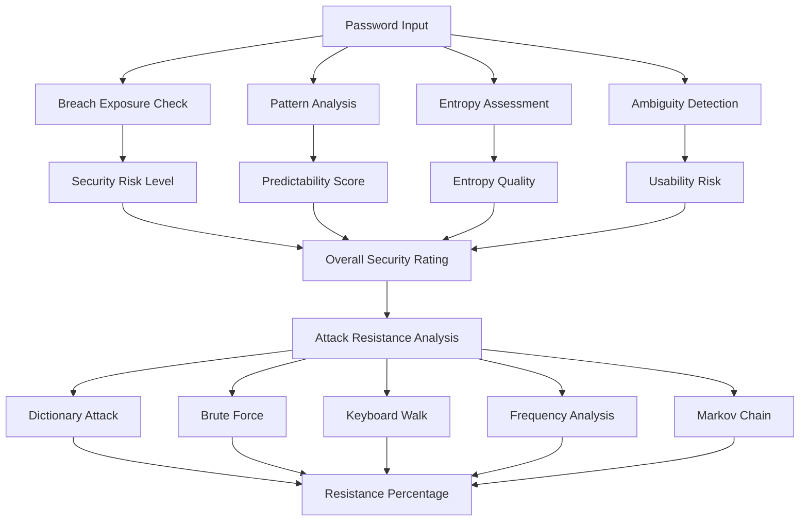

# IntentPass - Advanced Password Intentionality Analyzer

[](https://nextjs.org)
[](https://www.typescriptlang.org)
[](https://reactjs.org)
[](https://tailwindcss.com)
[](https://pnpm.io)

A cutting-edge password analysis platform that evaluates passwords beyond traditional complexity rules by measuring **intentionality**, **structural coherence**, and **actual security strength**.


## 🎨 Features & Capabilities

### 🔍 Multi-Dimensional Password Analysis
- **Intentionality Index**: Measures whether a password shows deliberate design vs random generation
- **Structural Coherence**: Evaluates logical segmentation and organization
- **Entropy Quality**: Advanced entropy calculation with character distribution analysis
- **Pattern Detection**: Identifies predictable sequences, keyboard walks, and weak substrings
- **Ambiguity Analysis**: Detects confusable characters that may cause entry errors

###  Behavioral Classification
Automatically categorizes passwords into five behavioral types:
- **Predictable**: Contains detectable sequences/patterns
- **Random**: High entropy, appears randomly generated
- **Passphrase**: Word-based passwords separated by spaces
- **Compliance Hack**: Meets rules but lacks intentionality
- **Balanced**: Well-designed with intention and security

###  Real-Time Security Intelligence
- **Breach Exposure Check**: Integrates with Have I Been Pwned API (client-side, privacy-safe)
- **Adversarial Simulation**: Analyzes resistance to 5 attack types (dictionary, brute force, keyboard walk, frequency analysis, Markov chain)
- **Policy Mode**: Toggle between Consumer (8 chars) and Enterprise (14 chars, NIST/CIS compliant) requirements

### Advanced Visualizations
- **6-Axis Radar Chart**: Multi-dimensional intentionality visualization
- **Entropy Distribution Map**: Segment-by-segment entropy breakdown
- **Keyboard Heatmap**: Interactive QWERTY usage visualization
- **Evolution Tracker**: Compare password versions over time
- **Benchmark Comparison**: Compare IntentPass vs Rule-Based vs zxcvbn-like systems

###  Gamification & Feedback
- **Tier System**: Bronze/Silver/Gold/Platinum badges based on intentionality score
- **AI-Powered Suggestions**: Context-specific improvement recommendations
- **Real-time Diagnostics**: Strengths and warnings as you type


##  Architecture Overview

```
app/
├── page.tsx              # Main application page
├── layout.tsx            # Root layout with metadata
└── globals.css           # Global styles and theme

components/
├── ui/                   # Reusable UI components (shadcn/ui)
├── PasswordInput.tsx     # Secure password entry component
├── ScoreDisplay.tsx      # Visual score presentation
├── RadarChart.tsx        # Multi-dimensional visualization
├── KeyboardHeatmap.tsx   # Interactive keyboard usage
├── EntropyMap.tsx        # Entropy distribution visualization
├── BreachStatus.tsx      # HIBP integration component
├── TierBadge.tsx         # Gamified tier display
├── BehavioralClassification.tsx  # Password type classifier
├── SuggestionsPanel.tsx  # AI improvement recommendations
├── AdversarialAnalysis.tsx       # Attack resistance analysis
├── BenchmarkComparison.tsx       # System comparison matrix
├── PolicyToggle.tsx      # Consumer/Enterprise mode switch
└── theme-provider.tsx    # Dark/light theme support

lib/
├── analyzer/             # Core analysis engine
│   ├── scorer.ts         # Main analysis orchestrator
│   ├── segmentAnalyzer.ts     # Password segmentation
│   ├── predictabilityAnalyzer.ts  # Pattern detection
│   ├── randomSmashAnalyzer.ts     # Randomness detection
│   ├── entropyAnalyzer.ts         # Entropy calculation
│   ├── ambiguityAnalyzer.ts       # Confusable character detection
│   ├── breachChecker.ts           # HIBP integration
│   ├── classifier.ts              # Behavioral classification
│   ├── suggestions.ts             # AI recommendations
│   ├── adversarial.ts             # Attack simulation
│   ├── benchmark.ts               # System comparison
│   ├── types.ts                   # TypeScript interfaces
│   └── constants.ts               # Configuration constants
│
└── context/
    └── PolicyContext.tsx          # Policy mode management

hooks/
├── use-mobile.ts         # Mobile detection hook
└── use-toast.ts          # Toast notification hook
```

## 🎯 Architecture Overview

### Recent Updates (2026)

#### ✨ UI Redesign
- **Modern Glassmorphism Design**: Backdrop blur effects with gradient accents
- **Enhanced Visual Hierarchy**: Card-based layout with improved spacing
- **Animated Background Elements**: Subtle pulsing gradients for visual interest
- **Sticky Header**: Navigation with logo and policy toggle
- **Improved Empty State**: Feature badges and engaging call-to-action
- **Custom CSS Animations**: Float, glow, and gradient animations

#### 🔧 Technical Improvements
- **Package Manager Cleanup**: Migrated to pnpm (removed npm lockfiles)
- **Viewport Metadata Fix**: Separated viewport from metadata export
- **Tailwind CSS v4**: Using latest version with PostCSS integration
- **Context Implementation**: Added PolicyContext for state management
- **Icon Assets**: All images properly configured in public folder

#### 🎨 Design Features
- **Gradient Text Effects**: Modern bg-clip-text styling
- **Backdrop Blur**: Glassmorphism on cards and header
- **Shadow Hierarchy**: Consistent elevation system
- **Color-Coded Metrics**: Visual distinction for different data types
- **Responsive Layout**: Mobile-first design with Tailwind breakpoints

##  System Data Flow Architecture

### 1. Main Application Flow


```mermaid
graph LR
    A[Input] --> B{Length}
    B -->|Empty| C[Empty]
    B -->|OK| D[Analyze]
    D --> E[Score]
    E --> F[Classify]
    F --> G[Suggest]
    G --> H[Security]
    H --> I[Display]
```

### 2. Password Analysis DFD (Data Flow Diagram - Level 0)


```mermaid
graph TD
    subgraph "External Entities"
        UE[User]
        AP[API Services - HIBP]
    end
    
    subgraph "Process 0: Password Analysis System"
        A[Input Validation]
        B[Segment Analysis]
        C[Predictability Analysis]
        D[Random Smash Analysis]
        E[Entropy Analysis]
        F[Ambiguity Analysis]
        G[Score Calculation]
        H[Classification]
        I[Suggestions Generation]
        J[Adversarial Analysis]
        K[Visualization Prep]
    end
    
    UE -->|Password Input| A
    A -->|Validated Password| B
    A -->|Validated Password| C
    A -->|Validated Password| D
    A -->|Validated Password| E
    A -->|Validated Password| F
    B -->|Segment Data| G
    C -->|Pattern Data| G
    D -->|Randomness Data| G
    E -->|Entropy Data| G
    F -->|Ambiguity Data| G
    G -->|Scores| H
    H -->|Classification| I
    H -->|Classification| J
    I -->|Suggestions| K
    J -->|Adversarial Data| K
    AP -->|Breach Data| J
    K -->|Processed Data| UE
```

### 2.1. Password Analysis DFD (Level 1 - Input Processing)


```mermaid
graph LR
    UE[User Entity] -->|Raw Password| A[Validate Input]
    A -->|Valid Password| B[Segment Analysis]
    A -->|Invalid Input| C[Error Response]
    B -->|Segment Data| D[Store Segmentation Results]
    D -->|Segmentation Output| E[Calculate Component Scores]
```

### 2.2. Password Analysis DFD (Level 1 - Core Analysis)


```mermaid
graph LR
    A[Segment Analysis] -->|Segments| B[Predictability Analysis]
    A -->|Segments| C[Random Smash Analysis]
    A -->|Segments| D[Entropy Analysis]
    A -->|Segments| E[Ambiguity Analysis]
    
    B -->|Predictability Data| F[Score Aggregation]
    C -->|Randomness Data| F
    D -->|Entropy Data| F
    E -->|Ambiguity Data| F
    
    F -->|Component Scores| G[Intentionality Calculation]
    G -->|Intentionality Index| H[Classification]
```

### 2.3. Password Analysis DFD (Level 1 - Output Processing)


```mermaid
graph RL
    A[Classification Results] --> B[Suggestions Generation]
    C[Adversarial Analysis] --> B
    D[Benchmark Comparison] --> B
    B -->|Enhanced Results| E[Visualization Data Prep]
    F[Raw Analysis Data] --> E
    E -->|Formatted Data| G[UI Components]
    G -->|Visual Output| H[User Display]
```

### 3. Component Analysis Pipeline


```mermaid
graph LR
    A[Password Input] --> B[SegmentAnalyzer]
    A --> C[PredictabilityAnalyzer]
    A --> D[RandomSmashAnalyzer]
    A --> E[EntropyAnalyzer]
    A --> F[AmbiguityAnalyzer]
    
    B --> G[Component Scorer]
    C --> G
    D --> G
    E --> G
    F --> G
    
    G --> H[Overall Score]
    G --> I[Intentionality Index]
    H --> J[Classification Engine]
    I --> J
    J --> K[Behavioral Types]
    K --> L[Suggestion Engine]
    L --> M[UI Components]
```
## 🚀 Quick Start

### Prerequisites
- **Node.js 18+** (recommended: Node.js 20+)
- **pnpm** (preferred) or npm
- Modern web browser (Chrome, Firefox, Edge, Safari)

### Installation

```bash
# Clone the repository
git clone <repository-url>
cd intent-pass-password-engine-main

# Install dependencies using pnpm (recommended)
pnpm install

# Alternative: using npm
npm install
```

### Development

```bash
# Start development server with Turbopack
pnpm dev

# The application will be available at:
# Local:   http://localhost:3000
# Network: http://<your-ip>:3000
```

### Production Build

```bash
# Build for production
pnpm build

# Start production server
pnpm start
```

### Code Quality

```bash
# Run ESLint
pnpm lint
```

## 🔐 Security Analysis Pipeline


```mermaid
graph TB
    A[Password Input] --> B[Breach Exposure Check]
    A --> C[Pattern Analysis]
    A --> D[Entropy Assessment]
    A --> E[Ambiguity Detection]
    
    B --> F[Security Risk Level]
    C --> G[Predictability Score]
    D --> H[Entropy Quality]
    E --> I[Usability Risk]
    
    F --> J[Overall Security Rating]
    G --> J
    H --> J
    I --> J
    
    J --> K[Attack Resistance Analysis]
    K --> L[Dictionary Attack]
    K --> M[Brute Force]
    K --> N[Keyboard Walk]
    K --> O[Frequency Analysis]
    K --> P[Markov Chain]
    
    L --> Q[Resistance Percentage]
    M --> Q
    N --> Q
    O --> Q
    P --> Q
```

## 🔧 Troubleshooting

### Common Issues

#### Module Resolution Errors
If you encounter "Module not found" errors:
```bash
# Clean install
rm -rf node_modules pnpm-lock.yaml
pnpm install
```

#### Tailwind CSS Not Loading
Ensure you're using the correct import syntax in `globals.css`:
```css
@import 'tailwindcss';
@import 'tw-animate-css';
```

#### Build Errors with Turbopack
Clear the build cache:
```bash
rm -rf .next
pnpm dev
```

#### Multiple Lockfiles Warning
Remove conflicting lockfiles:
```bash
# Keep only pnpm-lock.yaml
rm package-lock.json
pnpm install
```

### Performance Tips
- Use **pnpm** instead of npm for faster installs
- Enable Turbopack for development (default in v16+)
- Clear `.next` folder if experiencing stale builds

## 📝 License

This project is open source and available under the MIT License.

## 🤝 Contributing

Contributions are welcome! Please feel free to submit a Pull Request.

## 📞 Support

For issues and feature requests, please create an issue in the repository.

---

**Built with ❤️ using Next.js, React, TypeScript, and Tailwind CSS**

## 🛠️ Technology Stack

### Frontend Framework
- **Next.js 16.1** - React framework with App Router and Turbopack
- **React 19.2** - UI library with latest features
- **TypeScript 5.7** - Type-safe development

### Styling & UI
- **Tailwind CSS 4.2** - Utility-first CSS framework
- **shadcn/ui** - Beautiful, accessible component library
- **Radix UI** - Unstyled, accessible UI primitives
- **Lucide Icons** - Clean, modern icon set

### Visualization
- **Recharts** - Composable charting library
- **Custom SVG Components** - Hand-crafted visualizations

### Development Tools
- **Turbopack** - High-performance bundler (Rust-based)
- **PostCSS 8.5** - CSS transformation tool
- **ESLint** - Code linting and quality

## 📦 Project Structure

