# IntentPass - Advanced Password Intentionality Analyzer

A cutting-edge password analysis platform that evaluates passwords beyond traditional complexity rules by measuring **intentionality**, **structural coherence**, and **actual security strength**.

# IntentPass System Flow & Architecture

## 🔄 System Data Flow Architecture

### 1. Main Application Flow

### 2. Password Analysis DFA (Deterministic Finite Automaton)

```mermaid
stateDiagram-v2
    [*] --> EmptyState
    EmptyState --> ProcessingState: User types first character
    ProcessingState --> SegmentAnalysis: Password length ≥ 1
    SegmentAnalysis --> PredictabilityCheck: Segmentation complete
    PredictabilityCheck --> RandomSmashCheck: Pattern detection done
    RandomSmashCheck --> EntropyCalculation: Randomness analysis complete
    EntropyCalculation --> AmbiguityDetection: Entropy metrics calculated
    AmbiguityDetection --> ScoreAggregation: Ambiguity analysis complete
    ScoreAggregation --> IntentionalityClassification: All components analyzed
    IntentionalityClassification --> BehavioralClassification: Intent score calculated
    BehavioralClassification --> SuggestionGeneration: Classification complete
    SuggestionGeneration --> AdversarialSimulation: Suggestions ready
    AdversarialSimulation --> BenchmarkComparison: Attack resistance calculated
    BenchmarkComparison --> Visualization: All analyses complete
    Visualization --> [*]: Display results
    
    EmptyState --> EmptyState: No input
    ProcessingState --> EmptyState: User clears input
    Visualization --> ProcessingState: User modifies password
```

### 3. Component Analysis Pipeline

